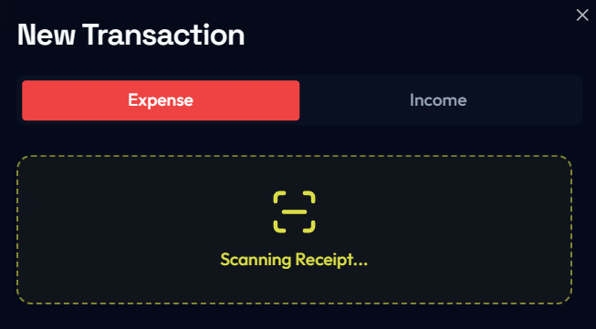
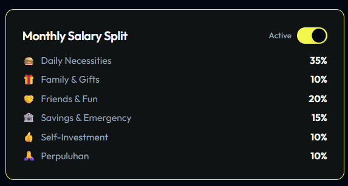
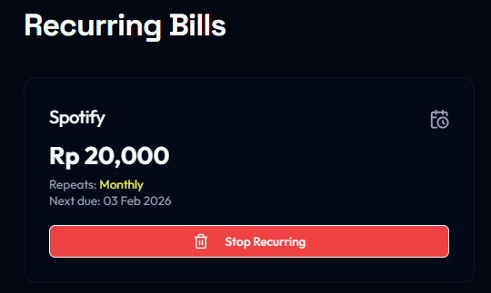

# SANGU ~ AI-Powered Expense & Income Tracker

## Overview
A production-grade personal finance system designed and implemented to explore **AI document understanding, automation orchestration, and secure multi-tenant data architecture**.

This project emphasizes **system design, correctness, and operational reliability** over being a reusable starter template.  
It processes real-world financial artifacts (receipts, invoices), converts them into structured data using AI, and surfaces actionable insights in real time.

---

## Motivation
Most expense trackers break down when dealing with **unstructured inputs**: noisy receipts, inconsistent formats, and partial data.

This system addresses that gap by combining:
- Vision-based AI for semantic extraction
- Deterministic post-processing to enforce correctness
- Event-driven automation to keep the UI thin and predictable

The design goal was simple: **AI may assist, but it must never be authoritative**.

---

## Core Capabilities

### AI-Based Receipt Understanding

- Vision-based OCR using **Gemini 2.5 Flash**
- Extracts totals, merchant names, payment methods, and inferred categories
- Category inference is constrained by **user-defined taxonomies** stored in PostgreSQL (no free-text drift)

---

### Automation-First Architecture

- **n8n** serves as the orchestration backbone, not the frontend
- Fully asynchronous receipt processing
- Explicit boundary between AI output and database persistence
- Human-confirmable structured responses returned to the client

---

### Financial Tracking & Analytics

- Unified ledger for income and expenses
- Budget thresholds with progress monitoring
- Real-time analytics rendered on the client

---

### Expense Splitting & Obligations

- Split-bill tracking with paid / unpaid states
- Clear ownership of obligations
- Designed for correctness over convenience

---

### Recurring Financial Events

- Support for recurring expenses and income
- Foundation for future forecasting and anomaly detection

---

## Technical Stack (Deliberate Choices)

### Frontend
- React 18 + Tailwind CSS
- Recharts for analytical visualizations
- UI layer contains **zero AI or business logic**

### Backend & Data
- Supabase (PostgreSQL, Auth, RLS, Storage)
- Strict row-level security for multi-tenant isolation
- Private object storage for all financial documents

### AI & Processing
- Gemini 2.5 Flash for low-latency visual parsing
- Custom JavaScript nodes for schema enforcement
- Regex-based numeric validation to prevent hallucinated values

---

## End-to-End Workflow (High Level)

1. Receipt uploaded from client via signed request
2. Webhook triggers automation pipeline
3. User context and category constraints loaded
4. AI performs vision + semantic extraction
5. Deterministic post-processing enforces schema safety
6. Structured data returned for explicit human confirmation

This design ensures **AI never writes directly to financial truth**.

---

## Security & Reliability Considerations
- No public access to financial documents
- All AI responses treated as untrusted input
- Database only accepts sanitized, typed values
- AI provider can be swapped without frontend changes

---

## What This Project Demonstrates
- Practical AI integration beyond prompt demos
- Event-driven system architecture
- Defensive engineering around LLMs
- Real-world automation design using n8n

---

## Status
Actively evolving.

Planned extensions:
- Anomaly detection on spending patterns
- Recurring transaction inference
- Multi-currency normalization